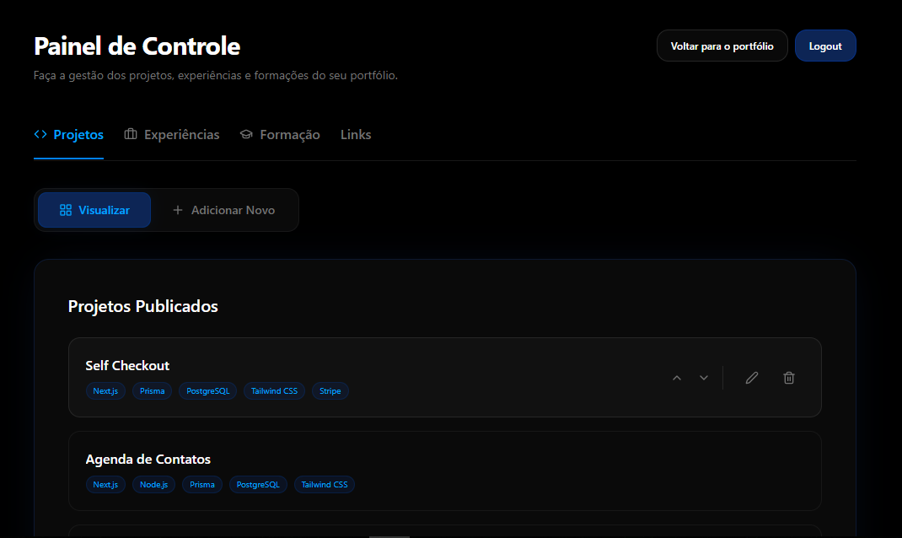

# 🚀 Lucas Almeida | Full Stack Developer Portfolio

Este projeto é um portfólio moderno e interativo, desenvolvido para apresentar projetos, experiências profissionais e formação acadêmica de forma elegante e performática. 

O grande diferencial deste projeto é o seu **Painel de Controle Administrativo "Secreto"**, que permite gerenciar todo o conteúdo do site em tempo real, sem a necessidade de alterar o código-fonte manualmente para cada atualização.

---

## 🛠️ Painel de Controle (Admin Dashboard)

Diferente de portfólios estáticos, este projeto conta com uma área administrativa protegida por autenticação, onde o desenvolvedor pode gerenciar dinamicamente todas as informações exibidas no site.



### ⚙️ Funcionalidades do Painel:
O painel de controle interage diretamente com o banco de dados via **Prisma ORM**, permitindo as seguintes operações de **CRUD** (Create, Read, Update, Delete):

- **📁 Gerenciamento de Projetos**: Adicionar novos projetos, editar os existentes, atualizar links de Deploy/GitHub e gerenciar as tecnologias utilizadas.
- **💼 Experiências Profissionais**: Cadastrar novas experiências, descrever responsabilidades e tecnologias aplicadas em cada cargo.
- **🎓 Formação Acadêmica**: Manter o currículo acadêmico atualizado com cursos e instituições.
- **🔗 Links e Redes Sociais**: Alterar links de contato e redes sociais de forma centralizada.
- **↕️ Ordenação Dinâmica**: Organizador de prioridade (Drag & Drop ou campos de ordem) para definir quais itens aparecem primeiro no site.

---

## 💻 Tech Stack

O projeto utiliza o que há de mais moderno no ecossistema JavaScript/TypeScript, focado em performance, SEO e escalabilidade:

- **Framework**: [Next.js 15+](https://nextjs.org/) (App Router & Server Actions)
- **Internacionalização/UI**: React 19 & Tailwind CSS 4.0
- **Linguagem**: TypeScript
- **Autenticação**: Next-Auth v5 (Auth.js)
- **Banco de Dados**: PostgreSQL
- **ORM**: Prisma
- **Gerenciamento de Monorepo**: Turborepo
- **Ícones**: Lucide React & React Icons
- **Notificações**: React Toastify

---

## 🏗️ Estrutura e Arquitetura de Pacotes

O projeto é organizado em um **Monorepo** gerenciado pelo **Turborepo**, utilizando uma arquitetura de pacotes internos para separar as responsabilidades e facilitar a manutenção:

- **`web` (`@portfolio/web`)**: A aplicação principal em Next.js. Responsável por toda a interface do usuário (UI), rotas públicas, Server Actions e o Painel de Controle Administrativo.
- **`database` (`@portfolio/database`)**: Camada de persistência. Contém o schema do Prisma, as migrações do banco de dados e a configuração do cliente Prisma para interagir com o PostgreSQL.
- **`core` (`@portfolio/core`)**: Pacote de lógica de negócio e utilitários. Responsável por funções compartilhadas, validações centrais e regras que podem ser reutilizadas em diferentes partes do sistema.
- **`packages` (`@portfolio/packages`)**: Contém schemas de validação e tipos compartilhados entre o frontend e o backend, garantindo consistência de dados em todo o monorepo.

---

## 🐳 Desenvolvimento Local com Docker (Branch `local`)

Para facilitar o setup do ambiente de desenvolvimento, o projeto possui uma branch específica chamada **`local`**. 

Nesta branch, é possível subir todo o ecossistema do projeto utilizando **Docker Compose**, incluindo:
- Banco de Dados PostgreSQL.
- **Firebase Emulator**: Permite testar funcionalidades que dependem do Firebase (como Storage ou Auth) localmente, sem custo e sem necessidade de conexão externa.

Isso garante que qualquer desenvolvedor consiga rodar o projeto completo com apenas um comando, sem precisar configurar cada serviço manualmente.

---

## 🚀 Como Executar

### Pré-requisitos:
- [Node.js](https://nodejs.org/) (v18+)
- [pnpm](https://pnpm.io/) (recomendado) ou npm/yarn
- Instância do PostgreSQL

### Instalação:

1. Instale as dependências:
   ```bash
   pnpm install
   ```

2. Configure as variáveis de ambiente:
   Crie arquivos `.env` nas pastas `web` e `database` conforme os exemplos `.env.example` (Configurações de Database URL, NextAuth Secret, etc).

3. Gere o cliente do Prisma e rode as migrações:
   ```bash
   pnpm db:generate
   ```

4. Inicie o ambiente de desenvolvimento:
   ```bash
   pnpm dev
   ```

O portfólio estará disponível em `http://localhost:3000`.

---
Feito por [Lucas Almeida](https://github.com/me-lucas-al)
